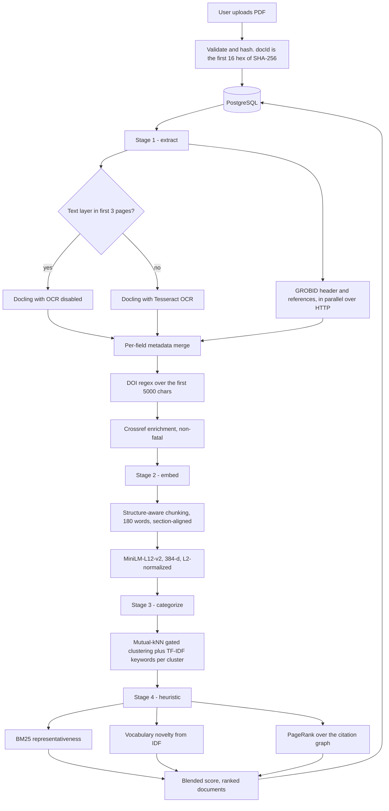
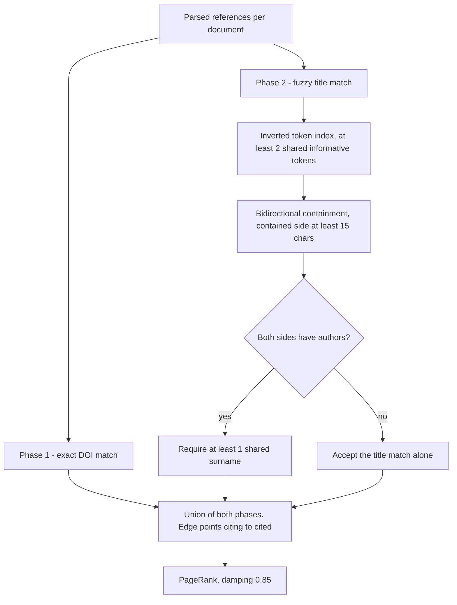
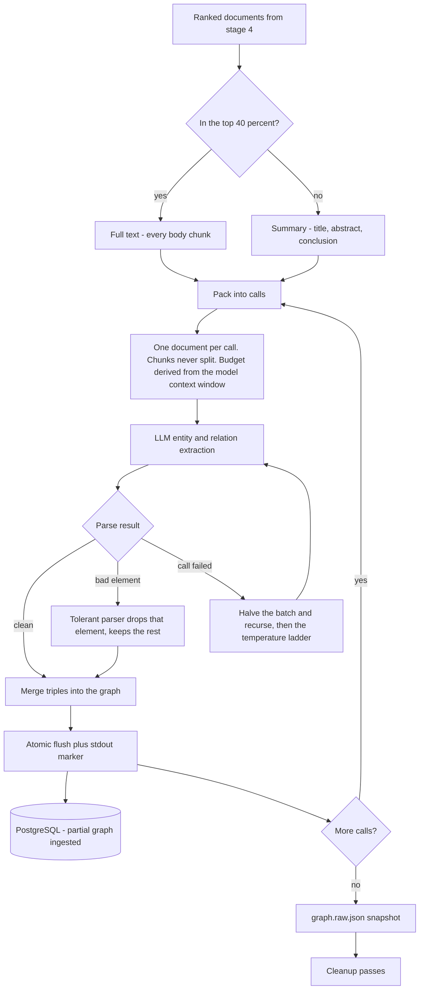
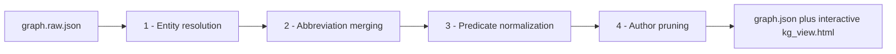
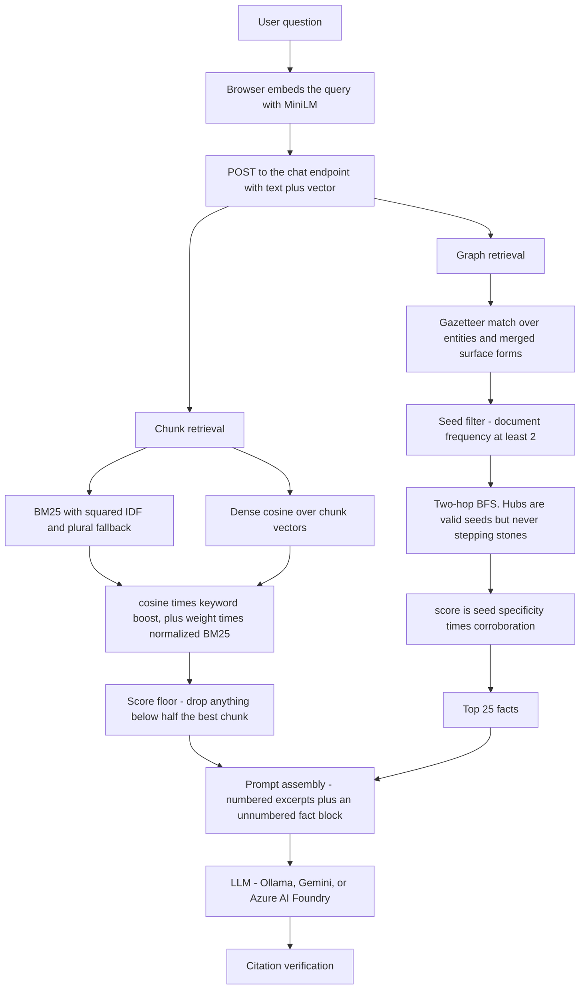
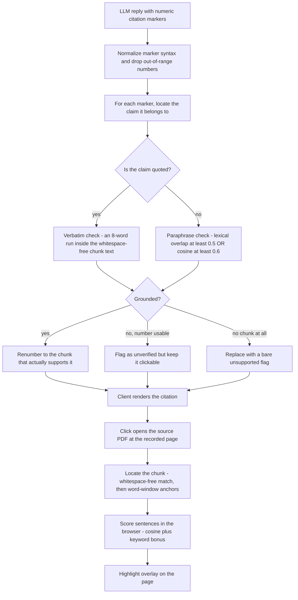

# OpenCrawl

A self-hosted web application that turns a collection of research PDFs into a searchable,
question-answerable knowledge base — and, critically, one whose answers can be traced back to
the exact sentence on the exact page that supports them.

Upload PDFs, and OpenCrawl extracts and structures them, builds a knowledge graph over the
corpus, and answers questions with hybrid retrieval augmented by graph facts. Every citation
the model produces is re-verified against the retrieved text before it reaches the user;
citations that check out become clickable and open the source PDF with the supporting
sentences highlighted, and citations that do not are visibly flagged.

The guiding principle is **verifiability over fluency**: a plausible answer that cannot be
traced to a source is treated as a defect, not a feature. Most of the design decisions
described below follow from that one constraint.

**Stack** — React 18 · Vite · Three.js · pdf.js · Node 22 · Express · PostgreSQL 16 · Prisma ·
Python 3.11 · Docling · Tesseract · GROBID · NetworkX · kg-gen · DSPy · scikit-learn ·
sentence-transformers · scispaCy

**Collections** are scoped to a named *crawler* — an ingestion strategy. `sapphire`, the
research-paper pipeline documented here, is the implemented one; `ruby` and `topaz` are
reserved.

---

## The ETL Pipeline



Stage order is declared explicitly in [backend/routes/pipeline.js](backend/routes/pipeline.js):

```js
export const INDEX_STAGE_ORDER = ['extract', 'embed', 'categorize', 'heuristic'];
export const STAGE_ORDER = [...INDEX_STAGE_ORDER, 'graph'];
```

`POST /pipeline/run` executes only the first four. The graph stage is deliberately excluded and
exposed separately at `POST /pipeline/build-graph`: indexing takes minutes and everything
downstream depends on it, whereas the graph is a multi-hour LLM job that nothing else blocks on.

### The export → stage → ingest contract

PostgreSQL is the single source of truth. Every stage has the same shape:

```
export from Postgres → run the stage against data/collections/<id>/ → ingest results back
```

The per-collection scratch directory holds JSON exchange files (`doclings.json`,
`embeddings.json`, `categories.json`, `graph.json`) and is fully disposable — deleting it loses
nothing, because every stage's output is ingested back into the database. This decoupling is
what lets a Python stage and a JavaScript stage sit next to each other in one pipeline without
either needing a database driver.

Python stages run as subprocesses spawned from the Express route handler, with stdout streamed
back line by line. Two environment settings matter and are set deliberately:
`PYTHONDONTWRITEBYTECODE` (a stray `.pyc` under `backend/` restarts the dev server's file
watcher mid-run) and `PYTHONUNBUFFERED` (Python block-buffers a piped stdout, so progress from a
multi-hour run sits invisible in an 8 KB buffer).

Each stage exports the *previous* stage's output before running, which is what lets it skip
already-completed work: `extract` skips documents that already have a docling, and `embed`
treats a document as fresh only if its newest chunk is newer than its extraction timestamp.

---

### Stage 1 — Extraction

**[backend/extraction/sapphire/extract.py](backend/extraction/sapphire/extract.py)**

Converts a PDF into structured text plus bibliographic metadata. This is the stage with the most
adversarial input: a scanned paper from 1998 and a clean arXiv preprint have to come out the
other side looking the same.

**OCR routing.** Running OCR on every document is enormously wasteful; running it on none loses
every scan. The stage decides per document by *probing for a text layer* — `pypdfium2` samples
the first three pages and checks for at least 200 extractable characters. Digitally-born PDFs
take the fast Docling path with OCR disabled; scans go through Docling with Tesseract. The probe
costs roughly 15 ms per document.

Both `DocumentConverter` instances are built once at module load and reused, since construction
is expensive. Docling's internal page-batch size is pinned to 1, because large scanned PDFs
otherwise exhaust memory in the C++ preprocessing layer.

**GROBID runs concurrently with Docling on the same PDF.** Docling recovers text and structure
but not reliably authors or a parsed reference list; GROBID — a machine-learning service built
specifically for parsing scholarly documents into TEI XML — supplies both. A `ThreadPoolExecutor`
dispatches the HTTP calls to GROBID while Docling churns locally, so the network wait overlaps
the CPU work instead of adding to it. Three endpoints are used: a liveness check,
`processHeaderDocument` for title/authors/abstract/date, and `processReferences` with raw
citations enabled.

GROBID is required rather than optional — it is the only source of authors and parsed
references, so an unreachable server raises. A server that is up but returns nothing (an
image-only scan, which GROBID does not OCR) is non-fatal.

**Metadata merges per field**, not per source:

```
GROBID TEI  →  structural extraction from section layout  →  Docling labels  →  first 200 body words
```

Each field falls back independently, so a partial GROBID header still gets its gaps filled.
**Title is the deliberate exception and gets no body-text fallback**, because downstream citation
matching works by string containment — a body snippet posing as a title would fabricate citation
edges between unrelated papers.

The `created` date comes from the GROBID TEI date, or failing that a scan of the first 3,000
characters only. Scanning the whole body would date every paper by the oldest year appearing in
its in-text citations.

**DOI extraction and Crossref enrichment** run as a JavaScript post-step
([doi_regex.js](backend/extraction/sapphire/doi_regex.js),
[search_doi.js](backend/extraction/sapphire/search_doi.js)). The DOI regex scans only the first
5,000 characters — the references section is full of *other* papers' DOIs, so searching the whole
text would attribute a neighbour's identifier to this paper. Any DOI found is resolved against
Crossref (polite-pool identification via `mailto`, with an on-disk response cache), which
supplies canonical title, authors, publication date, and a machine-readable reference list
carrying DOIs. A 404 is cached as a known miss; transient errors are not cached. Enrichment is
wrapped in a try/catch and never fails the stage.

**Output:** `doclings.json`, keyed by document ID — full text, markdown, sections, tables, raw
and parsed references, and merged metadata. NUL bytes, which come out of PDF font tables and
which PostgreSQL rejects outright, are stripped from the whole record.

---

### Stage 2 — Chunking and Embedding

**[backend/extraction/chunker.js](backend/extraction/chunker.js) ·
[backend/extraction/embed.js](backend/extraction/embed.js)**

Rather than sliding a fixed window over raw text, the chunker uses the document's own structure:

1. Runs of very short sections (under 60 words) merge, so a lone heading does not become a chunk.
2. Each section splits into ~180-word sentence-aligned chunks, prefixed with
   `"<paper title> — <section heading>\n"` so the heading participates in the embedding. The
   prefix length is recorded on the chunk so consumers can strip it.
3. Each table becomes exactly one chunk, truncated at 300 words — splitting a table destroys the
   only thing that makes it interpretable.
4. If no usable sections were recovered, it falls back to sentence-aware windowing.

Sentence splitting uses an abbreviation guard (`et al`, `e.g.`, `i.e.`, `cf.`, `vs.`, `Fig.`) and
an initials guard, so "Newman, M. E. J. showed…" is not split into four sentences.

**Chunk overlap is zero**, which is unusual. The reasoning is recorded in the source: overlap
cost roughly 18% duplicated corpus text, produced near-identical chunks competing for the same
top-K retrieval slots, and *deflated the BM25 IDF* — a term inside an overlap region has document
frequency 2 instead of 1, and the retriever squares IDF, so the distortion compounds.

**Embedding** runs `Xenova/all-MiniLM-L12-v2` quantized to ONNX through
`@xenova/transformers`, in batches of 32, mean-pooled and L2-normalized. Normalization means the
dot product *is* cosine similarity everywhere downstream, removing a per-comparison
normalization step.

The same model runs in three places that must agree: the backend indexer, the browser (which
embeds user queries and scores sentences for highlighting), and the backend claim grounder. The
model files are vendored into the repo and served from the app's own `/models` route, so the
browser never contacts Hugging Face and the app works offline.

The stored `dimensions` value is *measured* from the first vector rather than hard-coded, so
swapping the embedding model does not silently corrupt the index.

---

### Stage 3 — Categorization

**[backend/extraction/generate_categories.js](backend/extraction/generate_categories.js)**

Documents cluster by cosine similarity of their **title + abstract** embeddings, not an average
over full-text chunks — the average is dominated by methodology and boilerplate that every paper
in a field shares, washing out the distinctions that make a cluster meaningful.

The algorithm is **single-linkage union-find gated by mutual k-nearest-neighbours**: two
documents merge only if their similarity clears the threshold *and* each appears in the other's
top-10 neighbour list. The gate exists because plain single linkage transitively chains a corpus
into one blob — at a 0.5 threshold the 192-document reference corpus collapsed into one cluster
of 152 plus 26 singletons. At 0.65 with mutual-kNN agreement, the clusters are stable and
interpretable.

Each cluster records its members, its **top-20 TF-IDF keywords** over body text, and its
**medoid** (the member closest to the L2-normalized centroid). Those keywords become the single
source of keyword truth for the whole system — the ranking stage and the retriever both read
them rather than recomputing their own.

The stage also emits `doc_vectors.json`, so the frontend can re-cluster at any threshold the user
drags to without a round trip or re-embedding.

---

### Stage 4 — Document Ranking

**[backend/extraction/sapphire/heuristic.py](backend/extraction/sapphire/heuristic.py) ·
[heuristic_utils.py](backend/extraction/sapphire/heuristic_utils.py)**

Answers "which documents in this collection matter most?" — used by the graph stage to decide
which papers get read in full and which get summarized.

```
final = ALPHA * bm25_component + (1 - ALPHA) * pagerank
bm25_component = (1 - NOVELTY_WEIGHT) * representativeness + NOVELTY_WEIGHT * novelty
```

**Representativeness** measures how strongly a document exemplifies its own cluster. The document
is windowed into fixed 180-word passages, each scored with BM25 against the cluster's keywords,
and the mean of the top 5 is taken. Two details carry weight: BM25's average-document-length
parameter is pinned to the window size, so long documents get no length-normalization advantage;
and the divisor is always 5 even when fewer windows exist, so a two-page paper cannot win by
having only its single best window counted.

**Novelty** is the average IDF of the document's unique vocabulary. Terms appearing in exactly
one document are *excluded* — on an OCR'd corpus those are overwhelmingly scanning artifacts
rather than genuinely novel terminology. Reference sections are stripped before tokenization, so
a long bibliography does not read as a rich vocabulary.

**PageRank** runs over the citation connectivity graph below.

Components combine via **percentile (rank) normalization**, not max normalization. PageRank
scores are heavy-tailed; dividing by the maximum compresses everything below the top paper toward
zero and destroys the ordering information in the middle of the distribution. Representativeness
is percentile-normalized within cluster, novelty globally.

Top-k selection uses **per-cluster quotas by largest-remainder apportionment** with deterministic
tie-breaking. Without quotas, singleton clusters win every slot, since a document that is the only
member of its cluster trivially has a within-cluster percentile of 1.0.

---

### The Citation Connectivity Graph

**`build_connectivity()` in
[heuristic_utils.py](backend/extraction/sapphire/heuristic_utils.py)**

A directed graph over the collection where an edge from A to B means "A cites B", built entirely
from the papers' own parsed bibliographies — no external citation index required.



**Phase 1 — exact DOI matching.** Crossref reference lists frequently carry a DOI per cited work.
Normalizing those (stripping `https://doi.org/`, `doi:`, trailing punctuation) and matching
against the collection's own DOI index produces high-confidence edges essentially for free.

**Phase 2 — fuzzy title matching** over GROBID's parsed references, covering what Crossref did
not. Three problems had to be solved:

*Scale.* Comparing every reference against every title is quadratic. An **inverted token index**
generates candidates instead: informative tokens (length > 2, non-stopword) map to the titles
containing them, and a reference becomes a candidate only if it shares at least two of them.
Because the matcher uses containment, and containment implies the contained side's tokens all
appear in the container, this filter provably cannot discard a true match.

*Matching.* Titles match by **bidirectional containment** after normalization: equal, or one
contained in the other, provided the contained side is at least 15 characters — which stops a
generic title like "Networks" from matching half the corpus. Containment rather than equality was
necessary because GROBID regularly emits a mangled title. The canonical example from this corpus:
`"Provided proper attribution is provided, Google hereby grants permission… Attention Is All You
Need"` — the first-page license boilerplate with the real title appended. Journal-style references
frequently parse with the *journal name* as the title and no article title at all
(`title='Rev. Mod. Phys.'`, `authors=['R Albert', 'A-L Barabási']`).

*Disambiguation.* A surname gate guards against false positives. Author names normalize so that
`"Gomez, Aidan N."` and `"Aidan N. Gomez"` both reduce to `gomez`, and when both sides have
authors they must share at least one. When the cited work has no extracted authors — common, given
the journal-name-as-title case above — the title match is accepted alone rather than dropping a
probably-real edge.

**There is deliberately no publication-date check.** A "paper cannot cite the future" filter seems
obviously correct and is not, because `created` comes from PDF front matter: for a scan that is
when it was scanned, and arXiv re-stamps its PDFs on regeneration. Three condensed-matter papers
in this corpus are dated 2018, 2018, and 2021 for work published in 2002, 2003, and 2006. The
check was silently deleting a *correct* edge that had an exact title match, five shared surnames,
and a Crossref-resolved DOI. The reasoning is recorded in the source so it does not get
reintroduced.

Edges point from citing paper to cited paper, so PageRank flows through *incoming* edges — being
cited raises your score, and having a long reference list does not.

---

## Knowledge Graph Generation

**[backend/extraction/kg_graph.py](backend/extraction/kg_graph.py)**

Prompts an LLM to read the corpus and emit `(subject, predicate, object)` triples, using
**kg-gen** on top of **DSPy** (routing to Ollama, Gemini, or others via LiteLLM). This is the
most engineering-dense stage, because the failure modes of running a small model over thousands
of chunks are numerous and none of them are graceful by default.



### Document tiering

Sending every document's full text is prohibitively expensive; sending only abstracts produces a
shallow graph. The stage uses the ranking from stage 4 to split the corpus: the **top 40% get
full-text treatment** (every non-bibliography chunk), and the rest are **summarized** — title,
abstract, and conclusion only, capped at 4,000 characters. Abstracts come from extraction
metadata rather than chunks, because a paper's abstract is front matter and never became a chunk.

### Batch packing

Chunks pack greedily into calls under a character budget, subject to two invariants: a chunk is
never split across calls, and **two documents are never mixed into one call**. The second matters
for provenance — every relation records the document IDs it came from, and mixing documents would
produce cross-document triples that no author actually asserted.

The `"title — heading"` prefix the chunker added is **stripped** during packing and restated once
per call as a header. Left embedded in every chunk, small models extracted the paper's own title
as a graph entity from every single chunk, flooding the graph with title nodes.

**The per-call budget is derived from the model's context window**, not hard-coded:
`window_tokens × 0.18 × 4 chars/token`, clamped between 1,500 and 48,000 characters. Local models
get an additional explicit `num_ctx` cap — measured on a 4 GB GTX 970, raising the context window
to 16,384 pushed all but 5 of 27 model layers off the GPU onto the CPU and collapsed throughput.

### Failure handling, three layers

1. **A tolerant output parser** ([kg_adapter.py](backend/extraction/kg_adapter.py)) — a custom
   DSPy `ChatAdapter` subclass installed process-wide. DSPy validates `list[Relation]` as a single
   unit, so one bad element invalidates all ~40 triples in the response and escalates into DSPy's
   repair machinery. The measured cost was **32 model requests where 6 would have sufficed —
   roughly 81% of all model work spent on recovery.** The replacement validates element-wise with
   JSON repair plus a per-item type adapter, dropping only the bad elements and recording counters
   for what was dropped or salvaged.
2. **Split on failure** — if a call still fails, the batch halves and retries recursively up to
   three levels, rather than re-sampling the same oversized input.
3. **A temperature ladder** (`0.0, 0.4, 0.7`) at unsplittable leaves. Temperature 0 is cached by
   DSPy, so a retry must change temperature to be a genuinely new attempt.

### Incremental persistence

A multi-hour build that loses everything on a crash is unusable. After every successful call the
graph is rewritten atomically — temp file plus rename, with retry and backoff, because Windows
refuses to replace a file the parent process holds open — and a sentinel line is printed to
stdout. The Node parent watches for it and ingests the partial graph into PostgreSQL, serialized
through a promise chain so two collection updates never overlap
([pipeline.js](backend/routes/pipeline.js)). A run interrupted at hour three has persisted
everything up to hour three.

### Cleanup passes

A raw LLM-extracted graph is noisy in four specific, recurring ways. A snapshot of the unmerged
graph is written first — merging is a one-way door.



**1 · Lexical entity resolution**
([entity_resolution.py](backend/extraction/entity_resolution.py)) — `Machine-Learning`,
`machine learning`, and `Machine Learning` should be one node. But naive case folding is actively
harmful in a materials corpus: `CO` (carbon monoxide) is not `Co` (cobalt), and `CaS` is not
`CAS`. The resolver always folds joiners and punctuation, but **folds case only above four
characters and outside chemical-formula shapes**. Measured here: 67 of 900 case collisions were
genuinely distinct entities.

**2 · Abbreviation and acronym merging**
([abbreviations.py](backend/extraction/abbreviations.py)) — the hardest of the four, because
*embedding similarity does not work for it*. Measured cosine similarity between `DFT` and
`density functional theory` was **0.269 — below pairs of entirely unrelated terms** — while the
corpus states the definition outright 121 times. The solution abandons similarity for evidence: a
separate script runs the **Schwartz–Hearst algorithm** via scispaCy's `AbbreviationDetector` over
the corpus, collecting every `long form (SHORT)` definition an author actually wrote. The merge
pass then collapses a short form into an expansion only when that expansion holds **80% or more**
of its observed definitions, which prevents merging genuinely ambiguous acronyms like `GP`
(Gaussian process vs. genetic programming). Merging `DFT` alone added 178 edges to a node that
had 43. Because scispaCy pins an incompatible NumPy version, this runs in a separate virtual
environment and communicates through a JSON file.

**3 · Predicate normalization**
([predicate_normalization.py](backend/extraction/predicate_normalization.py)) — free-text
predicates explode: 3,824 distinct predicates for 22,485 relations. Merging by embedding
similarity alone over-merges badly, because "is derived from" and "is designed for" are lexically
similar and semantically opposite. The pass is two-stage: **cosine similarity nominates
candidates, a natural-language-inference cross-encoder decides**, requiring *mutual entailment* in
both directions (one-way entailment is a hypernym, not a synonym) under two sentence frames. A
passive-voice pre-filter drops inverse-direction pairs. Clustering uses **average linkage rather
than connected components** — single linkage produced one 223-member group spanning predicates
with nothing in common.

**4 · Author pruning**
([prune_authors.py](backend/extraction/sapphire/prune_authors.py)) — the extraction model reads
bibliographies and happily produces `("Barabási, A-L", "authored", …)`. Rather than name matching,
which would also delete legitimate entities that happen to be people, the pass uses
**per-predicate endpoint rules**: for `authored` the subject is an author; for `co-authored with`
both endpoints are. Those nodes and every relation touching them are removed. This pass runs on
*every* incremental flush, so partial graphs match the final one.

Shared machinery in [graph_merge.py](backend/extraction/graph_merge.py) picks each cluster's
representative (most-used, then shortest, then alphabetical), rewrites affected relations,
collapses resulting duplicates, unions their document-provenance lists, and folds away cluster
keys that a later pass merged out from under an earlier one.

### Reference build

A 192-document machine-learning and materials-science corpus:

| Metric | Value |
|---|---|
| Body chunks processed | 6,628 |
| Tiering | 77 full-text · 115 summarized |
| Entities · relations · distinct predicates | 20,301 · 22,260 · 2,581 |
| LLM calls | 1,145, **0 failed** |
| Tokens | 1,173,755 (950,225 prompt / 223,530 output) |
| Tolerant parser | 1 dropped element, 0 failed parses |
| Merge effect | entities 21,913 → 20,301 · predicates 3,824 → 2,581 (−32.5%) |
| Author nodes pruned | 1,195 |

---

## GraphRAG Retrieval

**[backend/retriever/retriever.js](backend/retriever/retriever.js) ·
[graph_retriever.js](backend/retriever/graph_retriever.js)**



### Hybrid chunk retrieval

There is no vector database. Chunk embeddings live in a JSON column on the chunk row and load
into a per-collection in-memory cache keyed on the collection's `corpusUpdatedAt` timestamp, then
scan linearly. At this corpus size a linear scan over normalized 384-dimensional vectors is a few
milliseconds, and it removes an entire piece of infrastructure from the deployment.

```js
score = cosine_similarity * keyword_boost + LEXICAL_WEIGHT * normalized_bm25
```

**The query is embedded in the browser** and POSTed as a vector, so the server never loads an
embedding model on the request path. Dimension mismatches are rejected with a 400.

**BM25** runs over a per-chunk term-frequency index built once per corpus load, with two
deliberate deviations from the textbook formula:

- **IDF is squared.** Meta-queries like "which document mentions quantum chemicals" carry several
  medium-rarity words whose combined classic-BM25 contribution outweighs the single rare term the
  user actually cares about. Squaring IDF restores the rare term's dominance.
- **Plural fallback.** The index is unstemmed, so a query token ending in `s` that matches nothing
  retries its singular form — "chemicals" falls back to "chemical".

BM25 scores normalize against the best-scoring chunk *for that query*, so the blend weight means
the same thing regardless of how rare the query's vocabulary happens to be.

**Keyword boost** multiplies every chunk in a category whose TF-IDF keywords the query hits by
`1.05^(matched keywords)` — a soft topical prior rather than a hard filter.

**Score floor.** Instead of always returning exactly top-K, chunks below 50% of the best chunk's
score are dropped, and the top chunk always survives. Without it, a question with exactly one real
answer still shipped seven near-misses the model then had to explain away.

### Entity linking is a gazetteer, not NER

An off-the-shelf named-entity recognizer predicts PERSON/ORG/LOCATION and would not recognize
"band gap" or "Perdew–Burke–Ernzerhof" at all. Instead the retriever builds a dictionary from
every entity in the graph **plus every surface form that merged into it**, so a query mentioning
"DFT" or "NequIP" resolves to the node those collapsed into. Two guards matter: self-loops are
skipped (merging an acronym into its expansion turns "NequIP is Neural Equivariant Interatomic
Potentials" into "X is X", high-corroboration and vacuous), and stale cluster keys are skipped
(a representative that is no longer an entity would return a node with zero relations).

Seed matching is longest-match-first and non-overlapping up to 6-word n-grams — matching every
sub-n-gram turned "density functional theory" into four seeds whose generic members swamped the
ranking. A curated junk-seed list filters table furniture and generic nouns; it is deliberately
*not* a length or digit heuristic, because in a materials corpus the two-character strings are
element symbols and among the most important entities present.

### Traversal and scoring

Breadth-first, two hops, with one critical constraint: **hub entities are valid seeds but never
stepping stones.** An entity appearing in more than 20 documents cannot be traversed *through*.
Measured on the 192-document corpus, unrestricted 2-hop traversal reaches 41–54% of the corpus and
unbounded traversal reaches 99%, because 57% of the graph is one connected component and
`machine learning` alone has degree 399. A per-hop decay factor weights direct neighbours above
second-hop facts, which are far more numerous and otherwise crowd out the fact that answers the
question.

Facts score on two signals:

- **Specificity** — the seed entity's IDF over documents, `log(N / doc_freq)`; measured spread
  1.16–4.16.
- **Corroboration** — how many documents independently assert the same triple.

A minimum seed document frequency guards against an inversion: extraction artifacts appear in
exactly one document and therefore score *highest* on IDF. Before the guard, the word "a" seeded
at IDF 5.26 while "graph neural networks" scored 3.06.

### Injection

Selected facts render into the prompt as a separate, **unnumbered** block, and the model appends a
`[G]` marker to any claim drawing on them. They are unnumbered because a triple is the extraction
model's paraphrase and appears verbatim in no chunk — numbering it would invite the verifier to
treat it as a quotable excerpt.

Graph facts are purely additive: chunk retrieval is untouched, and a collection with no graph, or
a question naming no known entity, answers exactly as it would without the graph.

---

## Citation Verification and Highlighting

**`repairCitations()` in [retriever.js](backend/retriever/retriever.js) ·
[DocumentViewer.jsx](frontend/src/components/DocumentViewer.jsx) ·
[Chat_utils.jsx](frontend/src/utils/Chat_utils.jsx)**

This is the core of the verifiability guarantee, and the one frontend concern documented here in
depth — because the check spans both sides: the server decides what is grounded, and the client
proves it by showing the reader the sentence.



### The verifier

**The model's citation numbers are treated as a guess, not an index.** For every marker:

1. **Normalize.** `[n1]`, `[N1]`, `[#1]`, `[source 1]`, and `[1](...)` all coerce to `[1]`;
   out-of-range numbers are dropped. Graph markers `[graph]`, `[g]`, `[KG]` coerce to `[G]`, and
   `[G]` is stripped entirely when no facts were sent.
2. **Locate the claim** — the nearest quoted span within a 400-character window, handling straight
   quotes, smart quotes, and blockquote lines; otherwise the surrounding sentence. This step
   handles small models parking a marker on its own line after the sentence it belongs to: the
   verifier takes the last non-blank sentence before the marker and glues on only what continues
   the same line.
3. **Quoted text must be literally verbatim** — an 8-word consecutive run present in the chunk's
   *whitespace-free* text, which makes the match immune to line-break hyphenation and spacing
   differences. Word overlap and cosine similarity are explicitly not sufficient for something
   presented in quotation marks.
4. **Paraphrases ground on either signal** — lexical overlap ≥ 0.5 **or** cosine ≥ 0.6 against the
   chunk embedding. Both are needed because they fail in opposite directions: a short true
   paraphrase scored 0.45 on overlap while a fabricated claim scored 0.48 — but the true paraphrase
   reuses the corpus's own vocabulary and clears the lexical bar. Claims are batch-embedded once;
   if embedding fails the verifier degrades to lexical-only with a warning rather than failing the
   request.

### Marker taxonomy

| Marker | Meaning | Rendering |
|---|---|---|
| `[n]` | Verified, renumbered to the chunk that supports it | Blue clickable button |
| `[n!]` | The model's link is plausible but unverified | Blue button plus a red flag |
| `[!]` | No chunk supports this claim at all | Red flag alone |
| `[G]` | Drawn from a knowledge-graph fact | Yellow non-clickable flag |

**Flag, don't drop.** An unverified citation keeps the model's own link clickable so the reader
can judge it, rather than being silently deleted — which would hide the failure — or silently
rewritten, which would fabricate support.

`[G]` is deliberately invisible to the verifier. A triple is the extraction model's paraphrase and
appears verbatim in no chunk, so grounding it would either flag a genuinely sourced fact as
fabricated or rewrite it into an `[n]` pointing at text that does not support it.

The prompts carry a matching **per-claim abstention rule** — abstain point by point, not just for
the question as a whole — because a 3×3 comparison where the corpus covered only six cells
produced three confabulated ones: the model completes whatever structure it started, and uncited
prose is never checked by the verifier.

### In-PDF highlighting

Clicking `[3]` must open the right PDF, at the right page, with the right *sentences* highlighted
— not the whole 180-word chunk.

**Locating the chunk** cannot rely on string equality, because pdf.js emits text as positioned
fragments and PDFs hyphenate across line ends. The viewer normalizes both sides to whitespace-free
strings, indexes each page's text items with their character spans, and tries the full chunk body
first, then progressively shorter word-window anchors at several offsets — searching the chunk's
recorded page range ±1 before falling back to the whole document.

**Highlight priority**, most precise first:

1. Verbatim quotes the backend verified, filtered to those contained in *this* citation's own
   citing sentence.
2. Best chunk sentences scored against the citing claim.
3. Best chunk sentences scored against the query (for source-chip clicks with no specific claim).
4. The whole matched chunk region.

**Per-sentence scoring runs in the browser**, using the same MiniLM model that indexed the corpus:

```js
score = dot(sentence_vector, focus_vector) + 0.1 * distinct_keyword_hits
```

with two different keep thresholds. Anchored to a specific claim, it keeps only sentences within
0.05 of the best; anchored to a vague query, it keeps anything above 60% of the best. The
distinction exists because same-domain sentences all sit on a high cosine floor, so a single ratio
threshold either highlights half the chunk or nothing. Any failure returns nothing and the caller
falls back to whole-chunk highlighting.

Marker-to-claim attribution is tracked per *occurrence*, not per marker value, so sentence 3's
`[2]` highlights a different span than sentence 1's `[2]` on the same chunk.

---

## Data Model

PostgreSQL via Prisma ([prisma/schema.prisma](prisma/schema.prisma)):
`User → Collection → {Document, Chunk, Chat}`, cascading on delete.

- **Document IDs are content-addressed** — the first 16 hex characters of the file's SHA-256. The
  same PDF uploaded to two collections gets the same ID, and re-uploading is idempotent.
- **`Collection.corpusUpdatedAt`** is the retrieval cache key. Every ingest bumps it, so one
  invalidation path covers both chunks and the graph.
- **`Collection.knowledgeGraphHtml`** is roughly 60 KB, so list queries omit that column
  explicitly.
- Chunk embeddings are a JSON float array on the chunk row, alongside the chunk's page range and
  its heading `prefixLen`.

---

## Known Limitations

- **Uncited assertions are never checked.** Verification only inspects text near a citation
  marker, so a model that states something without citing it bypasses grounding entirely.
- **Negation is invisible to semantic similarity.** "CGCNN representations are *not* invariant to
  the choice of unit cell" scores nearly identically against the same sentence without the
  negation. The verbatim requirement for quotes and the lexical bar for paraphrases mitigate this;
  they do not close it.
- **Corroboration is weak in practice.** 98.8% of triples originate from a single paper, so
  cross-document corroboration acts as a tiebreaker rather than a strong signal.
- **Small models under-comply with the `[G]` rule.** They use injected graph facts but omit the
  marker; restating the rule after the question recovered numeric citations but not `[G]`.
- **The query classifier is written but not wired** into the chat path.
- **Only the sapphire crawler is implemented.**
- **The PDF enhancement stage is retired.** `backend/parser/cleaning/enhance_pdf.js` still
  implements a raster → denoise → contrast → deskew → binarize chain and is still exposed at
  `POST /pipeline/enhance`, but it is excluded from `INDEX_STAGE_ORDER`; OCR routing now comes
  from the text-layer probe instead.
