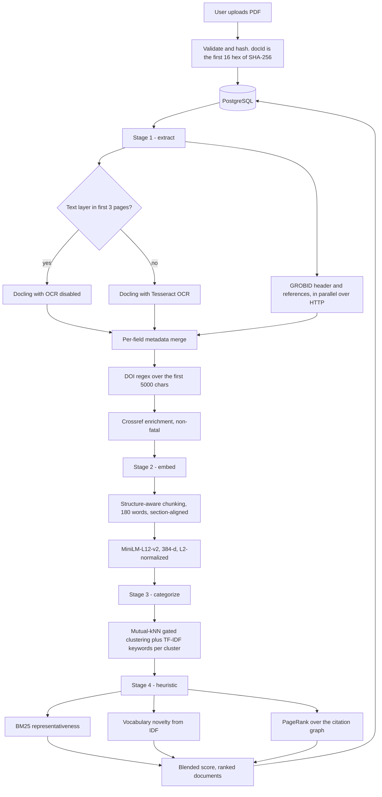
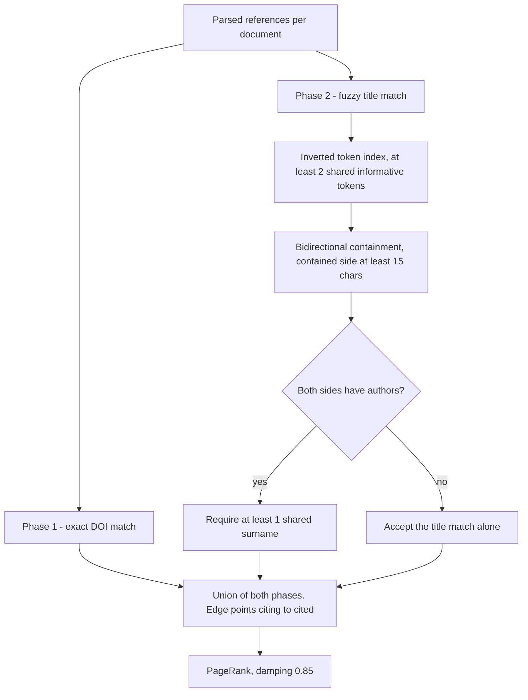
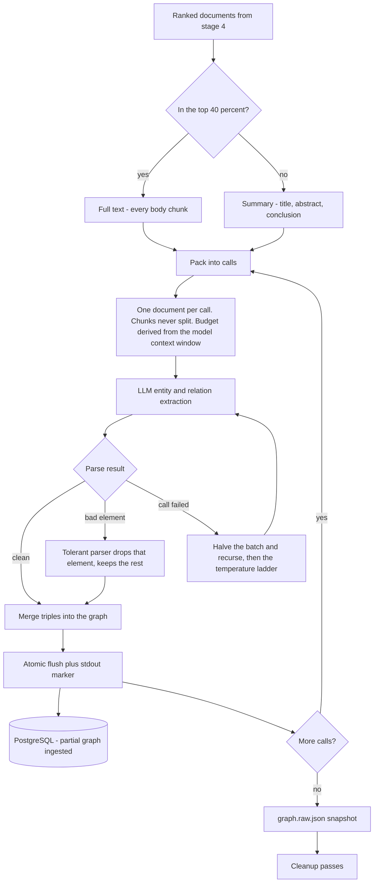
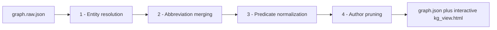
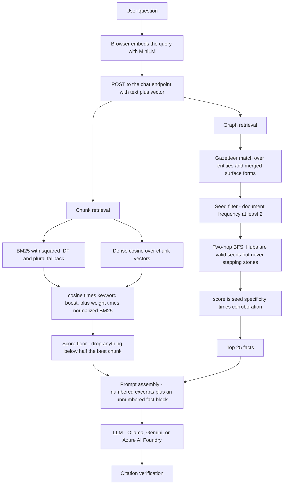
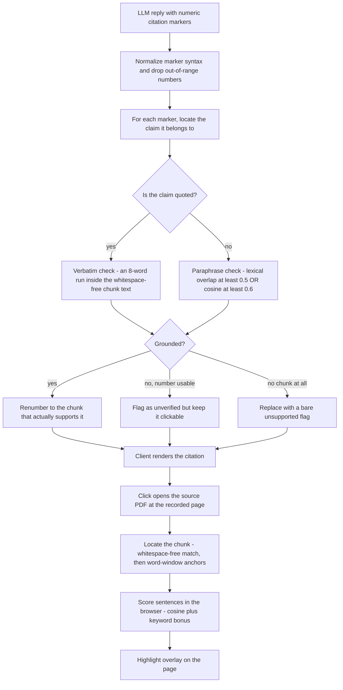

# OpenCrawl

**Ask questions about a library of research papers and get answers you can check.**

Upload PDFs — scanned or digital — and OpenCrawl extracts them, maps how they cite each other,
builds a knowledge graph over the whole corpus, and answers questions in chat. Every citation is
verified against the source text before you see it, and clicking one opens the PDF with the
supporting sentences highlighted.

The design principle is verifiability over fluency: an answer that cannot be traced to a source
is treated as a defect, not a feature.

---

## Features

**Grounded answers with sentence-level citations**
Each claim links to the passage that supports it. Click a citation and the source PDF opens to
the page with the exact sentences highlighted — not the whole paragraph.

**Automatic hallucination flagging**
Every citation the model writes is re-checked against the retrieved text. Quotes must match
verbatim; paraphrases must clear a lexical or semantic bar. Claims that fail are visibly marked
rather than silently accepted or quietly deleted.

**Handles scanned documents**
Digitally-born PDFs take a fast text path; scans are routed through OCR automatically. A
1990s scan and a clean arXiv preprint end up equally searchable.

**Automatic citation graph**
Reads each paper's own bibliography and links it to the other papers in your collection, then
uses PageRank over those links to surface which documents matter most — no external citation
index needed.

**Corpus-wide knowledge graph**
An LLM reads the collection and extracts entities and relationships, then cleanup passes merge
acronyms with their definitions, collapse duplicate concepts, unify synonymous relationships, and
strip author names.

**Graph-augmented retrieval**
Questions are answered from both retrieved passages and facts traversed from the knowledge
graph, so answers can draw on connections stated across different papers.

**Visual corpus exploration**
A 3D embedding map shows how documents cluster by topic, with an adjustable similarity threshold,
alongside an interactive view of the knowledge graph itself.

**Local or hosted models, per task**
Each role — extraction, graph building, answering — picks its own model independently. Run
everything locally through Ollama, or point the expensive stages at Gemini or Azure AI Foundry.

---

## How It Works

### Ingestion

- OCR is decided per document by probing the first pages for a text layer — about 15 ms, versus
  minutes wasted running OCR on a document that never needed it.
- Bibliographic parsing runs concurrently with text extraction, so the network wait overlaps the
  local work instead of adding to it.
- Metadata falls back field by field across four sources, so a partial result still gets its gaps
  filled.
- Chunks follow the document's own section structure rather than a fixed window, and tables stay
  intact as single units.
- Documents are content-addressed by hash, so re-uploading the same paper is idempotent.

### Citation Graph

- Two passes: exact DOI matches give certain edges, fuzzy title matching covers the rest.
- Titles match by containment rather than equality, because reference parsers routinely return
  mangled titles — first-page license boilerplate, or a journal name in place of the article.
- Shared author surnames disambiguate near-matches; an inverted index keeps candidate generation
  from going quadratic.
- Publication dates are deliberately ignored — a scanned PDF's date is when it was scanned, and
  arXiv re-stamps its files, so date filtering deletes correct links.

### Knowledge Graph

- The ranking decides depth: important papers are read in full, the rest by title, abstract, and
  conclusion — full coverage without full cost.
- Batches are sized from the model's actual context window, and never mix two documents, so every
  extracted fact keeps exact provenance.
- Three layers of failure handling — a tolerant parser that discards only the malformed item,
  batch halving, then a temperature ladder — kept 1,145 calls running with zero failures.
- Progress is saved after every call, so a multi-hour build interrupted at hour three keeps
  everything up to hour three.

### Graph Cleanup

- **Entity resolution** merges spelling and punctuation variants, while protecting case-sensitive
  distinctions like CO versus Co that naive folding would destroy.
- **Abbreviation merging** reunites acronyms with their definitions using the definitions authors
  actually wrote in the text — embedding similarity scores DFT against "density functional
  theory" below unrelated pairs, so similarity is the wrong instrument here.
- **Predicate normalization** collapses synonymous relationships, using a natural-language
  inference model to decide, since similarity alone would merge "derived from" with "designed for".
- **Author pruning** removes the paper authors that extraction pulls in from bibliographies —
  1,195 nodes on the reference corpus.

### Retrieval

- Keyword and semantic search are blended, so exact terminology and paraphrased questions both
  work.
- Results are cut by a relative score floor instead of a fixed count — a question with one real
  answer returns one, not seven near-misses the model has to explain away.
- Graph lookup matches entities and every surface form merged into them, so asking about "DFT"
  finds facts stored under the full name.
- Highly connected concepts can start a traversal but never be traversed through, which keeps
  two-hop expansion from reaching half the corpus.
- Queries are embedded in the browser, keeping model inference off the request path.

### Answer Verification

| Marker | Meaning |
|---|---|
| `[n]` | Verified, renumbered to the passage that actually supports it |
| `[n!]` | Plausible but unverified — kept clickable so you can judge it |
| `[!]` | No retrieved passage supports this claim |
| `[G]` | Drawn from a knowledge-graph fact |

- Citation numbers from the model are treated as a guess, not an index, and are corrected against
  what the text actually says.
- Quoted material is held to a stricter standard than paraphrase: it must appear word for word.
- Matching ignores whitespace, so PDF line-break hyphenation does not break a valid quote.
- Highlighting narrows to the specific sentences behind the claim, tightening or widening
  depending on whether you clicked a precise citation or a general source link.

---

## By the Numbers

Reference build — a 192-document machine-learning and materials-science corpus.

| | |
|---|---|
| Documents indexed | 192 PDFs → 6,628 searchable chunks |
| Knowledge graph | 20,301 entities · 22,260 relations |
| Cleanup effect | distinct relationship types 3,824 → 2,581 (−32%) |
| Author noise | 1,195 nodes removed|

---

## Stack

**Frontend** React 18 · Vite · Three.js · pdf.js · Transformers.js
**Backend** Node 22 · Express · PostgreSQL 16 · Prisma · JWT
**Processing** Python 3.11 · Docling · Tesseract · GROBID · NetworkX · kg-gen · DSPy
**Models** MiniLM-L12-v2 embeddings · NLI cross-encoder · Ollama, Gemini, or Azure AI Foundry

---

## Architecture

Implementation detail — stage-by-stage design, the reasoning behind each threshold, and the
measurements that motivated them — lives in **[docs/ARCHITECTURE.md](docs/ARCHITECTURE.md)**.
